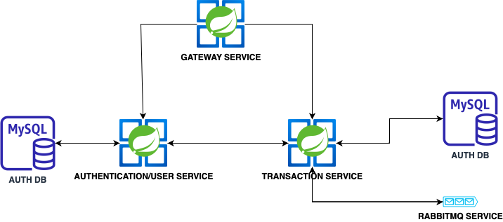

# Microservices with Spring Cloud Advanced Demo Bank Project 

In this project I'm demonstrating a simple banking application with 3 basic features; deposit, withdraw. Used Spring 6.0.4 and Java 17 for all microservices and I tried to use most up-to-date libraries and avoided deprecated ones. To note; I developed this project to learn java, spring and microservices just in 2 weeks. So, there is a highly chance of that code has lots of flaws and not in it's best shape. 

## Getting Started

### Usage
Build services;

```shell
# To skip confirmation for building projects and docker files separately use with s arg
./build_services.sh
```
This command build all 3 projects using maven and then build dockers using docker compose file.

In the most cases you need to have Maven and JDK17+. The best way to run the sample applications is with IDEs like IntelliJ IDEA or Eclipse.

Also you can use Insomnia to test api endpoints after building. Insomnia config file is added to root of the repository. You can import it to Insomnia and test endpoints without any configuration.

## Architecture

Our sample microservices-based system consists of the following modules:
- **gateway-service** - a module that Spring Cloud for running Spring Boot application that acts as a proxy/gateway in our architecture.
- **auth-service** - a module for authenticating requests using jwt and serving user details
- **transaction-service** - a module for executing transaction operations like deposit, withdraw and transfer using rabbitmq as queue service

The following picture illustrates the architecture described above.



## Things to improve/add
- Decouple authentication and user services
- Add a config service to manage configs
- Add a discovery service such as eureka
- Add unit and integration tests
- Enable Swagger documentation
- Better error handling
- Add more endpoints such as; viewing all transactions
